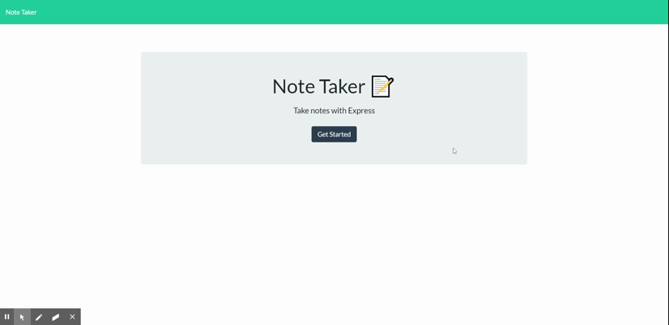

# Unit 11 Express Homework: Note Taker

## Description

This application uses an express backend to write, save, and delete notes from a JSON file.

## Table of Contents

* [Installation](#installation) 
* [License](#license) 
* [Contributors](#contributing) 
* [Tests](#tests)
* [Revisions](#Revisions) 

Revision History

## Installation

Run the app with heroku using the following link: 
> https://salty-dawn-62571.herokuapp.com/

If running app locally from terminal you will need to run the following commands to get started:
> npm i

> node server.js

The app will be rendered to: 
>http://localhost:8080/

## License

## Contributing

none

## Tests

none

## Revisions

note-taker_v1.0 - Initial commit: Note taker save feature is currently capable of writing note data to db.json file. Need to figure out how to update the data displayed being rendered by the server.

note-taker_v1.1 - Notes are now being rendered after creation of a new note. Notes can also be deleted, however it seems there is an issue with the delete request functionality as it will not work after a new note has been saved.

note-taker_v1.2 - Added a readFile function to the delete feature, as it turns out it wasn't receiving updated data from the db.json file. The delete feature is now functional.

note-taker_v1.3 - Commented code and updated README file.

- - -
© 2019 Trilogy Education Services, a 2U, Inc. brand. All Rights Reserved.